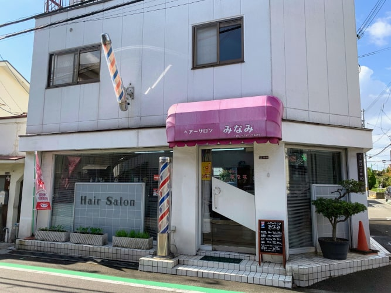
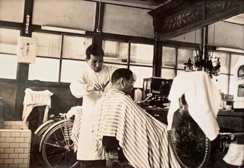

当店「ヘアーサロンみなみ」は、大阪市鶴見区の諸口1丁目にある理容店です。仕事を始めたのはお祖父ちゃんの代で、戦後間もない頃（1945年ごろ）だと聞いています。それから父、そして私と、親子三代にわたって、この地域で長く理容という業を続けています。

現在は店主である私と、私の母や妻に手伝ってもらいながら、ぼちぼち仕事を行っています。主として働く私は、理容歴30年以上。基本的に理容の仕事は何でもできますが、美容室のような美しいヘアスタイルは、やはりそちらのほうに軍配が上がると思います。経験してきた仕事上、あくまで理容、髪を整える仕事を得意としています（ちなみに私自身は美容師免許も持っていますが、一度も美容室で働いたことはありません）。

このような昔ながらの散髪屋ですが、従業員共々ご来店お待ちしております。