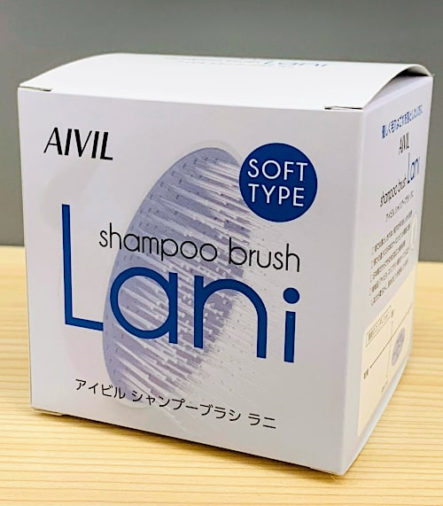
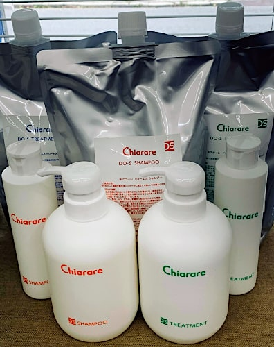
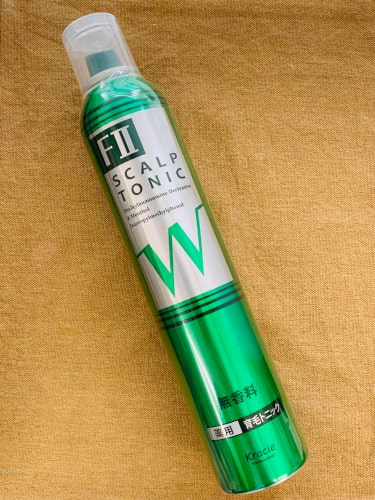

サロン専売品とは、理容室や美容室だけで買える商品のことです。お店では店販品などともいいます。

ドラッグストアやスーパーなどでもヘアー関連商品はありますが、そのような一般的な店舗（市販品）では買えず、理容室や美容室などでしか買えないのが、サロン専売品の本来の特徴。

基本的に市販のものより値段が高く、そのぶん製品の品質は良いとされています。

当店ももちろん、サロン専売品を取り扱っています。例えばこちらのシャンプーブラシ「ラニ (Lani)」

当店での洗髪時に実際に使っており、その気持ちよさからご購入されるかたもおられます。

また、元美容師の場末のパーマ屋さんが開発した、普通のシャンプーとは一味違うシャンプーとトリートメント「キアラーレDO-Sシャンプー＆トリートメン」

このような商品や、髪を傷めない白髪染め「ハナヘナ」なんかも、当店から購入することができます。

## 勉強させていただきます

ただ、昨今のネット販売での激しい価格競争のことを考えると、個人商店ではお客様のご期待に答えられない場合もあります。例えば、当店で一番よく売れている「薬用ケイカンロⅡ 育毛トニック」

こちらの商品は定価は2000円なのですが、ネットでは定価より安いものがほとんど。商品が手元に届くまで時間をガマンすれば、お買い得に購入することも可能です。

当店でも、いろいろ勉強させていただいてる（2本購入で値引きなど）のですが、現状ライバルのEC販売は巨大。個人商店ではいかんともしがたいところが、あったりなかったりします。

個人商店ならではの強みとしては、ご希望のサロン専売品を取り寄せるということができます。実際過去、サロンでしか売っていないシャンプー・トリートメントを探してご販売したことがあります。

もし、何らかのヘア関連商品などをお探しなら、お気軽にご相談ください。
